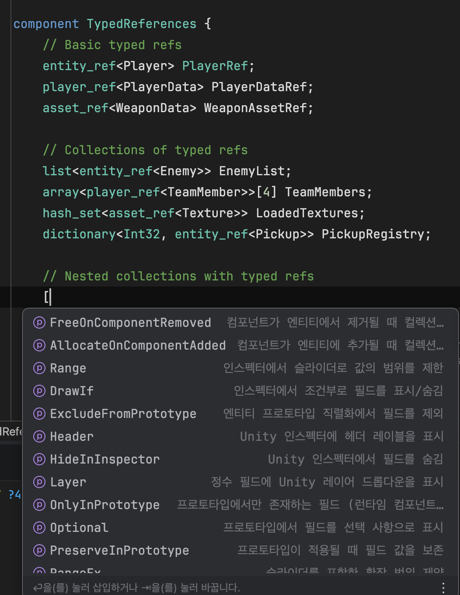

<p align="center">
  <a href="README.md">English</a> | <a href="README.ko.md">한국어</a> | <a href="README.ja.md">日本語</a> | <a href="README.zh-TW.md">繁體中文</a>
</p>

# QtnLSP

Photon Quantum3 DSL(`.qtn`)檔案的語法高亮與基於LSP的IntelliSense。

支援 **VSCode**、**JetBrains Rider** 和 **Visual Studio 2022**。

## 支援的IDE

| IDE | 版本 |
|-----|------|
| VSCode | 1.50+ |
| JetBrains Rider | 2022.3+ |
| Visual Studio | 2022 (17.0+) |

## 安裝

從 [GitHub Releases](../../releases) 下載最新版本。

**VSCode**
```bash
code --install-extension qtn-syntax-highlighting-<version>.vsix
```

**JetBrains Rider**
Settings > Plugins > Install Plugin from Disk > 選擇 `.zip` 檔案。

**Visual Studio 2022**
雙擊下載的 `.vsix` 檔案進行安裝。

## 建置

需要 [Docker](https://www.docker.com/)。無需其他本地工具鏈。

```bash
sh build.sh all        # 同步 + 測試 + 建置所有外掛
sh build.sh vscode     # 僅 VSCode 擴充功能
sh build.sh jetbrains  # 僅 JetBrains 外掛
```

## 截圖



## 授權

MIT
